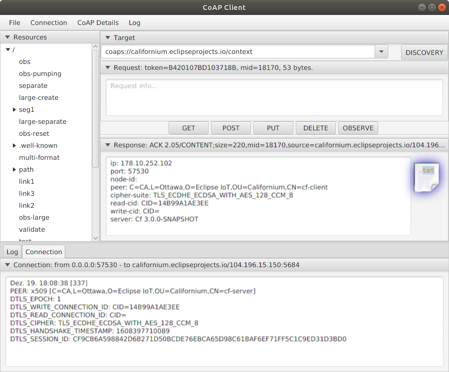

# Cf-Browser

A JavaFX application that uses the Californium libraries to act as `coap-client` to discover and interact with `coap-servers`.



## Prerequisite

Unfortunately `javaFX` was only a short time part of the java-JRE/JDK releases, mainly for oracle's java 1.7 and java 1.8. For openjdk's and since java 11 it's required to be installed as separate SDK, specific to the java-JRE/JDK used.

See [JavaFX/openJFX](https://openjfx.io/openjfx-docs/) for general information around JavaFX.
Downloads are available from [Gluon - Downloads](https://gluonhq.com/products/javafx/).
For Windows, download the windows SDK, e.g. [Gluon - Windows 64 bit, 17.0.1](https://download2.gluonhq.com/openjfx/17.0.1/openjfx-17.0.1_windows-x64_bin-sdk.zip) or an other version/variant listed at that download page.

Unzip the content of the downloaded zip into `<path>`. The `--module-path` must then contain `<path>\javafx-sdk-17.0.1\lib`.

For Ubuntu or other linux distributions, there are also packages available.

```sh
sudo apt install openjfx
```

Note: 

Using different versions of `java` and `javafx` may fail, ensure you use a proper pair.

## Download pre-build jar

Prebuild jars are available from the Eclipse Repository.

[Eclipse Repository - cf-browser-3.2.0.jar](https://repo.eclipse.org/content/repositories/californium-releases/org/eclipse/californium/cf-browser/3.2.0/cf-browser-3.2.0.jar)

Additional experimental TCP/TLS support (copy it to the same folder as the cf-browser-3.2.0.jar): 
[Eclipse Repository - cf-cli-tcp-netty-3.2.0.jar](https://repo.eclipse.org/content/repositories/californium-releases/org/eclipse/californium/cf-cli-tcp-netty/3.2.0/cf-cli-tcp-netty-3.2.0.jar)

## Build

oracle-jdk-8 or openjdk-11:

Just use mvn to build it, as usual.

```sh
mvn clean install
```

### Build for openjdk-8

Using openjdk-8 instead of oracle-jdk-8 requires to install openjfx-8 ahead. See [Stackoverflow](https://askubuntu.com/questions/1137891/how-to-install-run-java-8-and-javafx-on-ubuntu-18-04)

```sh
sudo apt install \
  openjfx=8u161-b12-1ubuntu2 \
  libopenjfx-java=8u161-b12-1ubuntu2 \
  libopenjfx-jni=8u161-b12-1ubuntu2
```

and 

```sh
sudo apt-mark hold \
  openjfx \
  libopenjfx-java \
  libopenjfx-jni
```

to prevent further updates, though the current recommended version is for java 11.

**Note:** if openjfx was marked to hold the java 8 version, updating to java 11 requires to mark the above modules with unhold and update & upgrade them to the java 11 version.

## Run

java-8:

```sh
java -jar cf-browser-3.2.0.jar
```

java-11 (module-path of Ubuntu 18.04):

```sh
java --module-path /usr/share/openjfx/lib --add-modules javafx.controls,javafx.fxml -jar cf-browser-3.2.0.jar
```

**Note:** If openjfx has been downloaded and installed manually, adapt the `--module-path` to
`<path>/javafx-sdk-???/lib`.

Alternatively, when using Java 11 or later, the application can be started from the
source folder using

```sh
mvn javafx:run
```

## Arguments

```sh
Usage: GUIClientFX [-hvV] [--help-auth] [--help-cipher] [--[no-]
                   subject-verification] [--payload-format] [-C=FILE]
                   [--cid-length=<cidLength>]
                   [--dtls-auto-handshake=<dtlsAutoHandshake>] [-i=<identity>]
                   [--local-port=<localPort>] [--mtu=<mtu>] [--proxy=<proxy>]
                   [--psk-index=<pskIndex>] [--psk-store=<pskStore>]
                   [--record-size=<recordSizeLimit>] [--tag=<tag>]
                   [-a=<authenticationModes>[:<authenticationModes>...]]...
                   [--cipher=<cipherSuites>[:<cipherSuites>...]]...
                   [--anonymous | [[-c=<certificate>]
                   [--private-key=<privateKey>]]] [-t=<trusts> [-t=<trusts>]...
                   | --trust-all] [-s=<text> | --secrethex=<hex> |
                   --secret64=<base64>] [--json | --cbor | --xml | --text |
                   --octets | --ctype=TYPE] [--payload=<text> |
                   --payloadhex=<hex> | --payload64=<base64> |
                   --payload-random=<size> | --payload-file=<filename>] [--con
                   | --non] [URI] [(more URIs)...]
      [URI]                  destination URI. Default coap://localhost:5683
      [(more URIs)...]       additional destination URIs.
  -a, --auth=<authenticationModes>[:<authenticationModes>...]
                             use authentikation modes. '--help-auth' to list
                               available authentication modes.
      --anonymous            anonymous, no certificate.
  -c, --cert=<certificate>   certificate store. Format
                               keystore#hexstorepwd#hexkeypwd#alias or keystore.
                               pem
  -C, --config=FILE          configuration file. Default Californium3.
                               properties.
      --cbor                 use cbor payload.
      --cid-length=<cidLength>
                             Use cid with length. 0 to support cid only without
                               using it.
      --cipher=<cipherSuites>[:<cipherSuites>...]
                             use ciphersuites. '--help-cipher' to list
                               available cipher suites.
      --con                  send request confirmed.
      --ctype=TYPE           use content type for payload.
      --dtls-auto-handshake=<dtlsAutoHandshake>
                             enable dtls auto-handshake with provided timeout.
                               Value in format time[unit], e.g. the recommended
                               value of "30[s]". Or time|unit, e.g. 30s.
                               Default disabled.
  -h, --help                 display a help message
      --help-auth            display a help message for authentication modes
      --help-cipher          display a help message for cipher suites
  -i, --identity=<identity>  PSK identity
      --json                 use json payload.
      --local-port=<localPort>
                             local porty. Default ephemeral port.
      --mtu=<mtu>            MTU.
      --[no-]subject-verification
                             enable/disable verification of server
                               certificate's subject.
      --non                  send request non-confirmed.
      --octets               use octet stream payload.
      --payload=<text>       payload, utf8
      --payload-file=<filename>
                             payload from file
      --payload-format       apply format to payload.
      --payload-random=<size>
                             random payload size
      --payload64=<base64>   payload, base64
      --payloadhex=<hex>     payload, hexadecimal
      --private-key=<privateKey>
                             private key store. Format
                               keystore#hexstorepwd#hexkeypwd#alias or keystore.
                               pem
      --proxy=<proxy>        use proxy. <address>:<port>[:<scheme>]. Default
                               env-value of COAP_PROXY.
      --psk-index=<pskIndex> Index of identity in PSK store. Starts at 0.
      --psk-store=<pskStore> PSK store. Lines format: identity=secretkey (in
                               base64).
      --record-size=<recordSizeLimit>
                             record size limit.
  -s, --secret=<text>        PSK secret, UTF-8
      --secret64=<base64>    PSK secret, base64
      --secrethex=<hex>      PSK secret, hexadecimal
  -t, --trusts=<trusts>      trusted certificates. Format
                               keystore#hexstorepwd#alias or truststore.pem
      --tag=<tag>            use logging tag.
      --text                 use plain-text payload.
      --trust-all            trust all valid certificates.
  -v, --[no-]verbose         verbose
  -V, --version              display version info
      --xml                  use xml payload.
```
